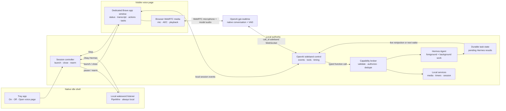

# WebRTC Wakeword Replacement Architecture

**Status:** Accepted

**Date:** 2026-07-21

**Branch:** `feature/webrtc-wakeword-replacement`

**Visual review artifact:** `/home/user/wiki/artifacts/html-docs/2026-07-21-webrtc-ohv-replacement-stage-1.html`

## Decision

Evolve the committed OpenAI Realtime spike into a separate, independently testable replacement candidate for Okay Hermes Voice (OHV).

The implementation remains OpenAI-only and uses a browser WebRTC media path. A native Linux tray and local wakeword listener open a visible dedicated Brave app page after “Okay Hermes.” The page owns microphone capture and model-audio playback for the life of the session, then closes automatically. The local wake listener rearms after teardown.

This is not an integration into the existing `okay-hermes-voice` repository. Existing OHV code is reference material only. The replacement must have its own package/runtime paths, systemd units, tray binary, tests, and installer surfaces so it can be refined without modifying or disabling OHV.

## Product boundary

The replacement owns:

- local idle wakeword detection;
- native tray state and controls;
- wake-to-page launch and session teardown;
- OpenAI `gpt-realtime` WebRTC media;
- OpenAI sideband control and event handling;
- visible transcript, action, task, and diagnostic state;
- local capability authorization and execution;
- Hermes task dispatch, cancellation, persistence, and result rejoining;
- interruption timing instrumentation;
- session/archive metrics.

It does not reuse OHV’s terminal popup, transcript-first router, Parakeet/Nemotron command STT loop, small-chat lane, TTS playback pipeline, or activation-flow package.

## Runtime topology

## Microphone handoff

The native wake listener detects only the wake phrase. On a detection it synchronously invokes the local activation handler and stops running wakeword inference until that handler returns.

The handler requests a voice session from the local controller and remains active until the browser session ends. The browser page then acquires the microphone directly with WebRTC constraints including echo cancellation, noise suppression, and automatic gain control.

The first slice may leave the native PipeWire capture stream open while inference is paused, matching the proven OHV handler-blocking pattern. Releasing and reacquiring the native stream is a later optimization only if measurement shows contention or device problems. There must never be two active wake inference loops during a voice session.

## Session lifecycle

1. Tray/controller and wake listener are running; no browser or OpenAI session exists.
2. The local listener detects “Okay Hermes.”
3. Wake inference pauses and the activation handler notifies the controller.
4. The controller launches Brave in app mode with a dedicated user-data directory and loopback page URL.
5. The page connects to the local control WebSocket and creates its WebRTC offer.
6. The controller creates the OpenAI Realtime call, captures the `call_id`, joins the sideband WebSocket, and returns the SDP answer plus opaque local session scope.
7. The page sends microphone audio and receives model audio over WebRTC.
8. The controller receives authoritative session/tool events over sideband and publishes safe UI events to the page.
9. A close phrase, Stop button, tray Turn Off, idle timeout, or unrecoverable failure starts teardown.
10. The page stops microphone tracks, data channel, peer connection, and remote audio.
11. The controller closes only the dedicated Brave app process/window.
12. The activation handler returns and wakeword inference rearms.

## Visible webpage

The webpage replaces both Streamlit and OHV’s terminal popup as the primary session surface.

Always visible during a session:

- connection, microphone, listening, responding, interrupted, and error state;
- Stop control;
- live user and assistant transcript;
- local action request and result state;
- Hermes task state.

Collapsed diagnostic drawer:

- native OpenAI event names and IDs;
- wake, browser-launch, SDP, and session-ready timestamps;
- VAD speech start/stop timing;
- response cancellation/truncation state;
- local playback suppression timing;
- connection-state transitions and teardown reason.

The page opens on wake and closes after the session. It is not a persistent dashboard and does not require a Start button in normal wakeword operation. A diagnostic/manual launch mode may retain an explicit Start control for testing.

## OpenAI control boundary

Browser responsibilities:

- microphone permission and `getUserMedia`;
- `RTCPeerConnection` media transport;
- remote audio playback;
- immediate local playback suppression during interruption;
- visible UI rendering;
- deterministic track/data-channel/peer cleanup.

Controller responsibilities:

- permanent API credential;
- `/v1/realtime/calls` request and SDP relay;
- `Location`/`call_id` extraction;
- sideband WebSocket lifecycle;
- server-owned prompt, model, voice, VAD, transcription, and tool configuration;
- OpenAI event correlation;
- capability authorization/execution;
- idempotency and session scope;
- task persistence and result reinjection;
- timing/archive persistence.

The webpage never receives `OPENAI_API_KEY`, arbitrary shell access, or direct authority to execute local actions.

## Interruption contract

WebRTC remains the media transport because OpenAI manages its output buffer and automatically truncates unplayed audio when VAD detects an interruption.

For every interruption, persist:

1. best available user-speech onset time;
2. receipt time and provider `audio_start_ms` from `input_audio_buffer.speech_started`;
3. response cancellation terminal event/time;
4. local playback suppression time;
5. server truncation confirmation/state;
6. listening-restored time;
7. next-response first-audio time.

On `speech_started`, the page must suppress residual model audio immediately and the controller must observe cancellation/truncation. The implementation must not infer correctness from transcript timing alone.

The initial VAD configuration remains explicit and testable. The spike’s `semantic_vad` `eagerness: high` is not accepted as a permanent default until measured against real interruption traces.

## Local capabilities and Hermes

OpenAI may propose only typed allowlisted function calls. The local controller validates schema, authorizes policy, deduplicates `call_id`, executes the service, and returns a structured result.

Initial replacement capabilities:

- current time;
- session end;
- timer start/cancel;
- media play/pause/resume/skip;
- Hermes task start/cancel/status.

Long Hermes tasks receive durable local task IDs and do not block the foreground Realtime loop. Results completed during a live session are reinjected into that exact session. Results completed after closure remain pending and rejoin on the next wake session. There is no global pending-result slot.

Product-level capability services may remain independent of OpenAI. OpenAI session, event, interruption, transcript, and function-continuation behavior must not be hidden behind a generic provider adapter.

## Isolation from existing OHV

Use collision-safe names and paths. Do not install replacement files over OHV files.

Planned examples:

- systemd: `okay-hermes-realtime-controller.service`, `okay-hermes-realtime-wakeword.service`;
- tray binary: `okay-hermes-realtime-tray`;
- config: `~/.config/okay-hermes-realtime/config.yaml`;
- runtime sockets/state: `$XDG_RUNTIME_DIR/okay-hermes-realtime/`;
- durable state/logs: `~/.local/state/okay-hermes-realtime/`;
- Brave profile: `~/.local/share/okay-hermes-realtime/brave-profile/`.

The existing ONNX wakeword model may be referenced read-only from its installed location. The installer must not disable, modify, or rename existing OHV services. Test instructions must explicitly prevent running both wake listeners at once.

## First working-slice acceptance criteria

1. Saying “Okay Hermes” opens the dedicated visible page without pressing Start.
2. Wakeword inference pauses before the page begins the active session.
3. The page establishes an OpenAI WebRTC session through the local controller.
4. A natural voice turn completes.
5. An audible response can be interrupted and the full timing trace is visible/persisted.
6. Stop and an explicit close phrase both tear down WebRTC, close the dedicated page, and rearm wake detection.
7. No terminal popup or Streamlit runtime is used.
8. Existing OHV source, services, config, and installed binaries remain untouched.
9. Automated tests cover control protocol, launch/close ownership, stale session behavior, interruption timeline reduction, and native service/tray contracts.
10. A live smoke records wake-to-page, speech-stop-to-first-audio, interruption-to-silence, teardown, and measured RSS/PSS/CPU for the replacement processes.

## Non-goals for the first slice

- Native WebSocket audio transport.
- Another realtime provider.
- Provider adapters or normalized provider events.
- Phone/background-browser wakeword operation.
- Reusing OHV’s terminal popup, local STT router, or TTS loop.
- Automatically replacing or disabling the installed OHV service.
- Completing every local media and Hermes task executor before wake/session/interruption lifecycle is proven.
